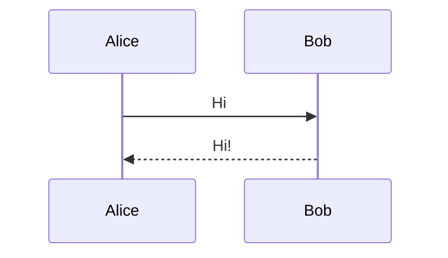
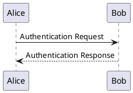

# MarkdownX — Markdown Extra for Bitbucket

[](LICENSE)
[](https://www.atlassian.com/software/bitbucket)

Enhanced Markdown rendering for Bitbucket Data Center: **Mermaid** diagrams, **PlantUML** diagrams, and **LaTeX math** (KaTeX) — right inside the file browser, pull request diffs, commits, and READMEs.

## Features

- **Mermaid diagrams** — 20+ diagram types (flowcharts, sequence, class, state, ER, Gantt, pie, git-graph, mindmap, timeline, C4, Sankey, XY, etc.). Rendered client-side, loaded lazily.
- **PlantUML diagrams** — 15+ UML and non-UML diagram types. Rendered server-side to SVG.
- **LaTeX math** — block (` ```math `) and inline (`$…$`, `$$…$$`) formulas via KaTeX.
- **Mermaid themes** — default / dark / forest / neutral, selectable in plugin admin.

All features run everywhere rendered Markdown appears: file view, file browser, pull request descriptions and diffs, commits, and compare views.

## Requirements

- Bitbucket Data Center **8.19+** (tested on 8.19, targets 9.x and 10.x — see Compatibility below)
- Java 11+ (runtime, provided by Bitbucket)

## Installation

1. Download the latest `markdown-extra-*.jar` from [Releases](https://github.com/plainward/markdown-extra-bitbucket/releases).
2. In Bitbucket: **Administration → Manage apps → Upload app**.
3. Upload the JAR. That's it — all features are active.

## Usage

Just write regular Markdown:

````markdown




```math
E = mc^2
```

Inline math: $a^2 + b^2 = c^2$.
````

Diagrams render automatically when the file is viewed in Bitbucket.

## Build

```bash
cd frontend && npm install && npm run build && cd ..

export JAVA_HOME=/path/to/jdk21
mvn package -DskipTests
```

The resulting JAR is written to `target/markdown-extra-<version>.jar`.

## Local deploy

After building, upload the JAR to a running Bitbucket via the UPM REST API:

```bash
./deploy.sh [BITBUCKET_URL] [USERNAME] [PASSWORD]
# defaults: http://localhost:7990  admin  admin
```

Or start a clean Bitbucket 8.19 in Docker:

```bash
cd docker
docker compose up -d
./deploy-plugin.sh admin admin    # deploys target/*.jar to localhost:7990
```

For Bitbucket 10.x use `docker-compose.10x.yml` and `deploy-plugin-10x.sh` (runs on `localhost:7991`).

## Architecture

| Layer | Files |
|-------|-------|
| Plugin descriptor | `src/main/resources/atlassian-plugin.xml` |
| Spring scan config | `src/main/resources/META-INF/spring/plugin-context.xml` |
| REST (settings, PlantUML) | `src/main/java/com/plainward/bitbucket/markdownx/rest/` |
| Services (settings, PlantUML render) | `src/main/java/com/plainward/bitbucket/markdownx/service/` |
| Admin SPA | `src/main/resources/static/markdownx-admin/` |
| Frontend orchestrator | `frontend/src/markdown-enhancer.js` |
| Mermaid (iframe + Shadow DOM) | `frontend/src/mermaid-enhancer.js` |
| PlantUML (REST → SVG) | `frontend/src/plantuml-enhancer.js` |
| LaTeX (KaTeX) | `frontend/src/katex-enhancer.js` |
| MutationObserver | `frontend/src/utils/dom-observer.js` |

Two non-obvious choices are worth calling out:

- **Mermaid renders inside a hidden `<iframe>`, then mounts into a Shadow DOM.** Bitbucket loads different CSS bundles per page context (`filebrowser` vs `fileContent`), and the page CSS corrupts Mermaid's `getBBox()` text measurements if it renders in an offscreen container on the host page. An iframe gives it a clean document.
- **Built JS is named `*-min.js` to bypass the AMPS YUI Compressor.** The compressor is ES3-only and silently destroys the ES6+ output from Vite; AMPS skips any filename with the `-min` suffix.

## Development

### Bundled docker compose

```bash
cd docker
docker compose up -d       # Bitbucket 8.19 on http://localhost:7990
# or
docker compose -f docker-compose.10x.yml up -d   # Bitbucket 10.x on :7991
```

Default credentials after first-run setup: `admin` / `admin` (configure during Bitbucket onboarding). Edit `docker/.env` to pick a different Bitbucket patch version.

### Debug logging in the browser

```js
localStorage.setItem('markdownx-debug', '1');  // enable, then reload
localStorage.removeItem('markdownx-debug');    // disable
```

### Test URLs (local Bitbucket on 8.x)

- File browser: `http://localhost:7990/projects/TEST/repos/test-markdown/browse?at=main`
- File view: `http://localhost:7990/projects/TEST/repos/test-markdown/browse/README.md?at=main`
- Admin: Bitbucket **Administration → Add-ons → MarkdownX Admin** (or open `http://localhost:7990/download/resources/com.plainward.bitbucket.markdown-extra:admin-resources/admin.html` directly)

## Compatibility

| Bitbucket DC | Status |
|--------------|--------|
| 8.x (8.19+)  | Tested |
| 9.x          | Expected to work |
| 10.x         | Expected to work |

## Contributing

Contributions welcome — see [CONTRIBUTING.md](CONTRIBUTING.md).

## Security

Please report vulnerabilities privately — see [SECURITY.md](SECURITY.md).

## License

Apache License 2.0. See [LICENSE](LICENSE).
