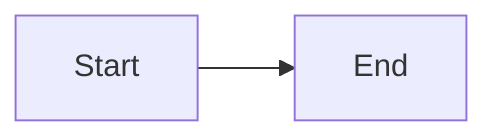
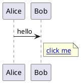

# MarkdownX live smoke test

## Mermaid


```mermaid
flowchart LR
    A[Start] --> B[End]
    click B "javascript:alert('xss-mermaid')"
```

## PlantUML


```plantuml
@startuml
Alice -> Bob : hello
note right of Bob
  [[javascript:alert('xss-plantuml') click me]]
end note
@enduml
```

## Math

```math
E = mc^2 + \href{javascript:alert('xss-katex')}{click}
```

Inline math: $a^2 + b^2 = c^2$.
